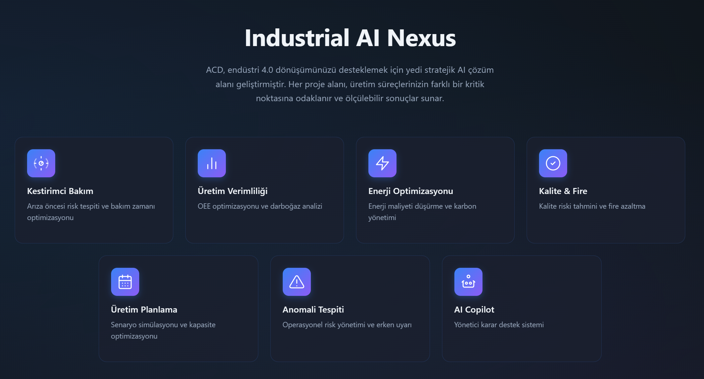
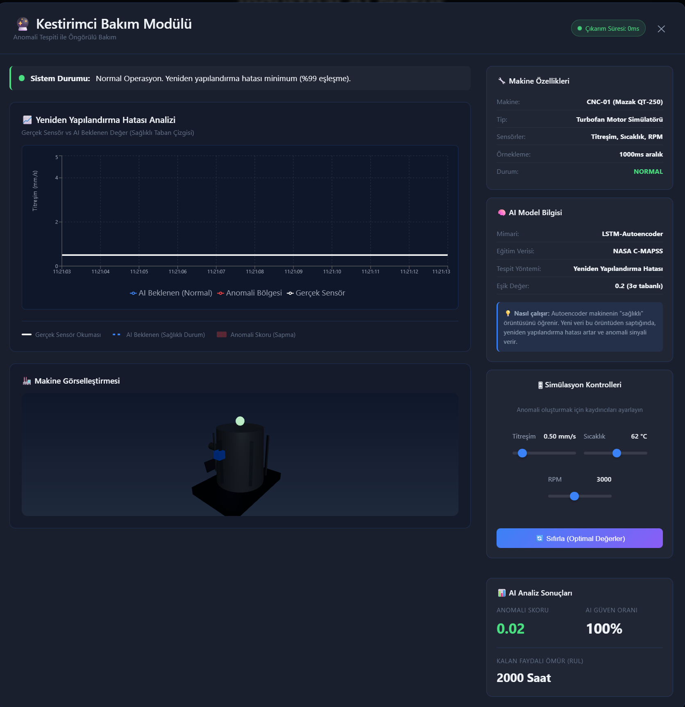
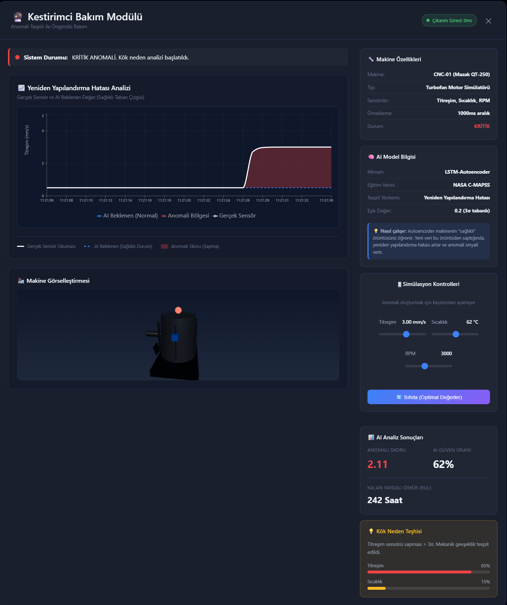
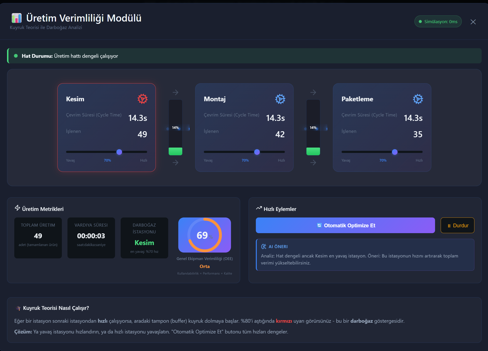
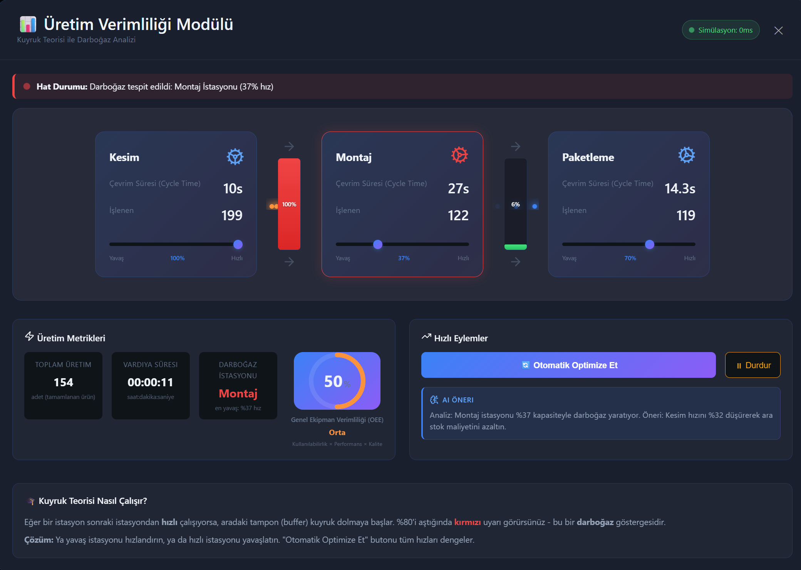

# 🏭 Industrial AI Nexus



**Endüstriyel Yapay Zeka Çözümleri Demo Platformu**

Industrial AI Nexus, modern üretim tesislerinde yapay zekanın gücünü somutlaştırmak için geliştirilmiş, kurulum gerektirmeyen, tamamen tarayıcı tabanlı bir simülasyon ve görselleştirme platformudur.

[🌐 **CANLI DEMO İÇİN TIKLAYIN**](https://akerdogmus.github.io/industrial-ai-nexus/)

---

## ⚡ Özellikler

- **Kurulumsuz:** Tamamen Client-Side çalışır, sunucu gerektirmez.
- **İnteraktif:** Gerçek zamanlı veri akışı ve simülasyonlar.
- **Modern UI:** Glassmorphism, Dark Mode ve Cyberpunk estetiği.
- **Responsive:** Tüm modern tarayıcılarla uyumlu.

## 📊 Modüller ve Senaryolar

Platform, endüstrinin farklı dikeylerindeki problemleri çözen 7 bağımsız modül içerir:

### 1. 🔍 Kestirimci Bakım (Predictive Maintenance)
CNC tezgahlarından gelen titreşim ve sıcaklık verilerini analiz ederek arıza riskini önceden tahmin eder.
> *Potansiyel Kazanım: Bakım maliyetlerinde %30 düşüş*

### 2. 🏭 Üretim Verimliliği (Digital Twin)
Şişeleme hattının dijital ikizi üzerinde darboğazları analiz eder ve OEE (Genel Ekipman Etkinliği) optimizasyonu sağlar.
> *Potansiyel Kazanım: %25 OEE artışı*

### 3. ⚡ Enerji Optimizasyonu
Endüstriyel fırınların enerji tüketimini, değişen elektrik tarifelerine göre optimize ederek maliyetleri düşürür.
> *Potansiyel Kazanım: Enerji faturasında %22 tasarruf*

### 4. 👁️ Kalite & Fire (Computer Vision)
Üretim hattından geçen parçaları gerçek zamanlı görüntü işleme ile denetler, hatalı ürünleri segmente eder.
> *Potansiyel Kazanım: Hatalı üründe %99 yakalama oranı*

### 5. 📅 Üretim Planlama
Karmaşık sipariş havuzunu, makine hazırlık (setup) sürelerini minimize edecek şekilde yapay zeka ile otomatik çizelgeler.
> *Potansiyel Kazanım: Teslimat sürelerinde %25 iyileşme*

### 6. 📉 Anomali Tespiti
Yüksek frekanslı sensör verilerindeki (akım/voltaj) milisaniyelik sapmaları yakalar.
> *Potansiyel Kazanım: %94.5 anomali tespit başarısı*

### 7. 🤖 AI Copilot
Fabrika yöneticilerinin doğal dil ile veri tabanını sorgulamasına ve rapor almasına olanak tanır (RAG & LLM Simülasyonu).
> *Özellik: Doğal dil ile "Geçen haftaki duruşların sebebi neydi?" diye sorabilme.*

---

## � Kurulum ve Çalıştırma

### 🌐 Canlı Kullanım (Önerilen)
Hiçbir şey kurmanıza gerek yok. Doğrudan tarayıcınızdan erişin:
**[https://akerdogmus.github.io/industrial-ai-nexus/](https://akerdogmus.github.io/industrial-ai-nexus/)**

### 💻 Yerel Geliştirme (Localhost)

Projeyi kendi bilgisayarınızda geliştirmek isterseniz:

1. **Repoyu klonlayın:**
   ```bash
   git clone https://github.com/Akerdogmus/industrial-ai-nexus.git
   cd industrial-ai-nexus
   ```

2. **Bağımlılıkları yükleyin ve başlatın:**
   ```bash
   cd frontend
   npm install
   npm run dev
   ```

3. **Alternatif (Windows):**
   Ana dizindeki `start_demo.bat` dosyasına çift tıklayın.

---

## 📷 Galeri

| Dashboard | Analiz |
|-----------|--------|
|  |  |
|  |  |

---

## 🛠️ Teknoloji Yığını

- **Frontend:** React 19, TypeScript, Vite
- **Görselleştirme:** Recharts, Framer Motion, Lucide React
- **Stil:** CSS Variables, Glassmorphism, HSL Color Palette
- **Simülasyon:** Pure TypeScript Logic Engines

---

## 📝 Lisans

Bu proje [MIT Lisansı](LICENSE) ile lisanslanmıştır.

---
