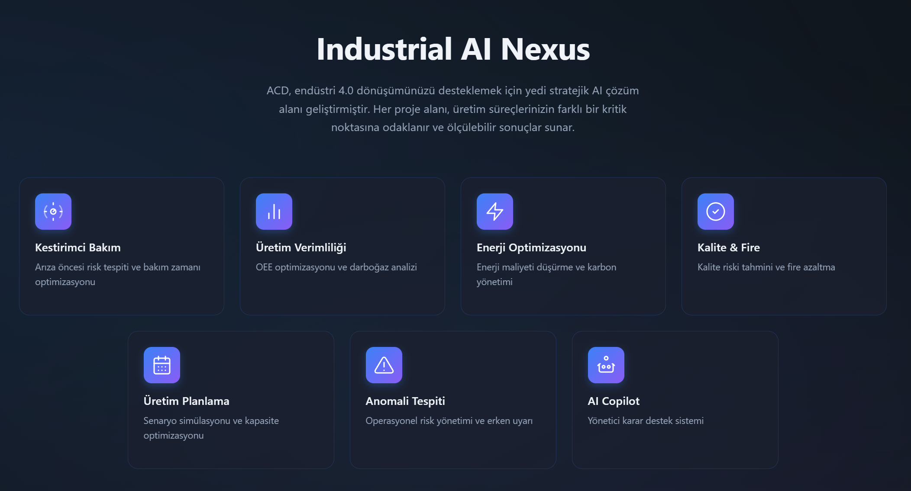
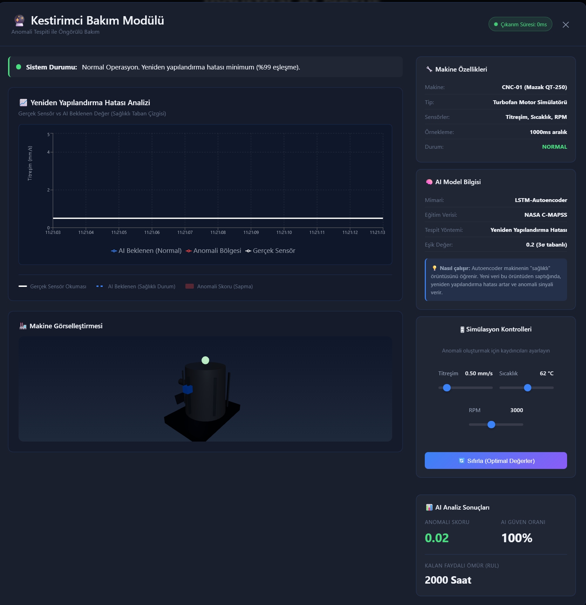
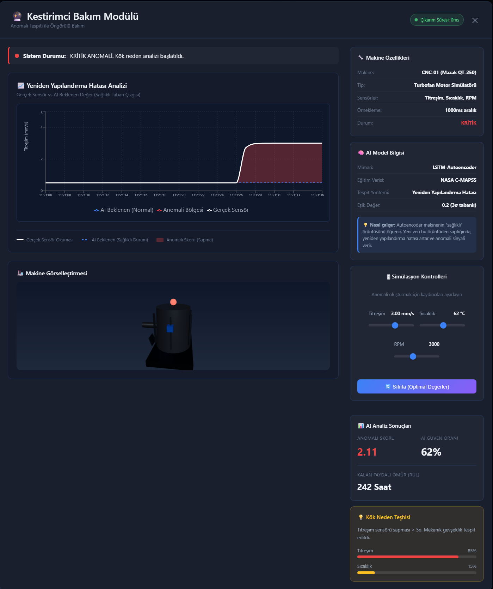
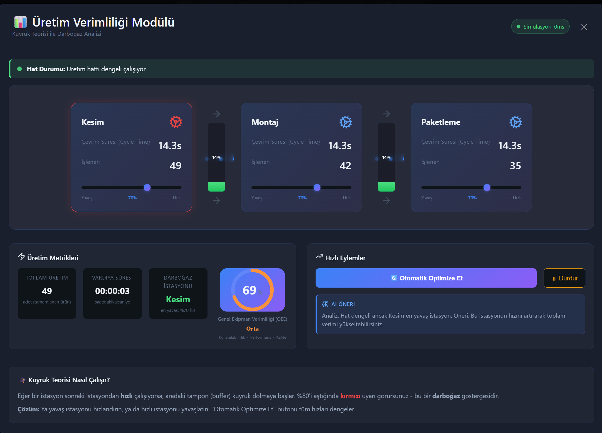
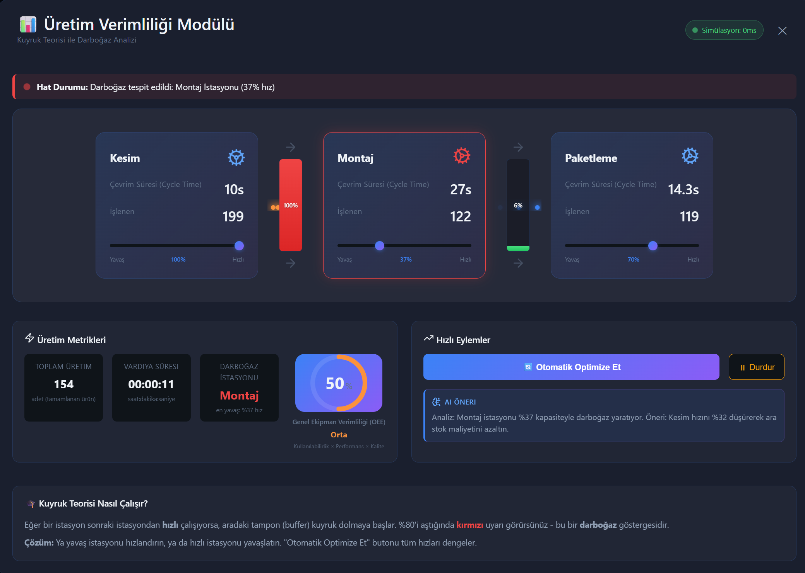

# 🏭 Industrial AI Nexus



**Endüstriyel Yapay Zeka Çözümleri Demo Platformu**

Industrial AI Nexus, modern üretim tesislerinde yapay zekanın gücünü somutlaştırmak için geliştirilmiş, kurulum gerektirmeyen, tamamen tarayıcı tabanlı bir simülasyon ve görselleştirme platformudur.

[🌐 **CANLI DEMO İÇİN TIKLAYIN**](https://akerdogmus.github.io/industrial-ai-nexus/)

---

## ⚡ Özellikler

- **Kurulumsuz:** Tamamen Client-Side çalışır, sunucu gerektirmez.
- **İnteraktif:** Gerçek zamanlı veri akışı ve simülasyonlar.
- **Modern UI:** Glassmorphism, Dark Mode ve Cyberpunk estetiği.
- **Responsive:** Tüm modern tarayıcılarla uyumlu.

## 📊 Modüller ve Senaryolar

Platform, endüstrinin farklı dikeylerindeki problemleri çözen 7 bağımsız modül içerir:

### 1. 🔍 Kestirimci Bakım (Predictive Maintenance)
CNC tezgahlarından gelen titreşim ve sıcaklık verilerini analiz ederek arıza riskini önceden tahmin eder.
> *Potansiyel Kazanım: Bakım maliyetlerinde %30 düşüş*

### 2. 🏭 Üretim Verimliliği (Digital Twin)
Şişeleme hattının dijital ikizi üzerinde darboğazları analiz eder ve OEE (Genel Ekipman Etkinliği) optimizasyonu sağlar.
> *Potansiyel Kazanım: %25 OEE artışı*

### 3. ⚡ Enerji Optimizasyonu
Endüstriyel fırınların enerji tüketimini, değişen elektrik tarifelerine göre optimize ederek maliyetleri düşürür.
> *Potansiyel Kazanım: Enerji faturasında %22 tasarruf*

### 4. 👁️ Kalite & Fire (Computer Vision)
Üretim hattından geçen parçaları gerçek zamanlı görüntü işleme ile denetler, hatalı ürünleri segmente eder.
> *Potansiyel Kazanım: Hatalı üründe %99 yakalama oranı*

### 5. 📅 Üretim Planlama
Karmaşık sipariş havuzunu, makine hazırlık (setup) sürelerini minimize edecek şekilde yapay zeka ile otomatik çizelgeler. AI'nın EDD algoritmasıyla optimizasyon sürecini adım adım gösterir.
> *Potansiyel Kazanım: Teslimat sürelerinde %25 iyileşme*

### 6. 📉 Anomali Tespiti
Basınç, sıcaklık ve titreşim sensörlerinden gelen yüksek frekanslı verilerdeki istatistiksel sapmaları Z-Score tabanlı hibrit algoritmayla gerçek zamanlı tespit eder.
> *Potansiyel Kazanım: %94.5 anomali tespit başarısı*

### 7. 🤖 AI Copilot
Fabrika yöneticilerinin doğal dil ile veri tabanını sorgulamasına ve rapor almasına olanak tanır (RAG & LLM Simülasyonu).
> *Özellik: Doğal dil ile "Geçen haftaki duruşların sebebi neydi?" diye sorabilme.*

---

## � Kurulum ve Çalıştırma

### 🌐 Canlı Kullanım (Önerilen)
Hiçbir şey kurmanıza gerek yok. Doğrudan tarayıcınızdan erişin:
**[https://akerdogmus.github.io/industrial-ai-nexus/](https://akerdogmus.github.io/industrial-ai-nexus/)**

### 💻 Yerel Geliştirme (Localhost)

Projeyi kendi bilgisayarınızda geliştirmek isterseniz:

1. **Repoyu klonlayın:**
   ```bash
   git clone https://github.com/Akerdogmus/industrial-ai-nexus.git
   cd industrial-ai-nexus
   ```

2. **Bağımlılıkları yükleyin ve başlatın:**
   ```bash
   cd frontend
   npm install
   npm run dev
   ```

3. **Alternatif (Windows):**
   Ana dizindeki `start_demo.bat` dosyasına çift tıklayın.

---

## 📷 Galeri

| Dashboard | Analiz |
|-----------|--------|
|  |  |
|  |  |

---

## 🛠️ Teknoloji Yığını

- **Frontend:** React 19, TypeScript, Vite
- **Görselleştirme:** Recharts, Framer Motion, Lucide React
- **Stil:** CSS Variables, Glassmorphism, HSL Color Palette
- **Simülasyon:** Pure TypeScript Logic Engines

---

## 📝 Lisans

Bu proje [MIT Lisansı](LICENSE) ile lisanslanmıştır.

---

* Version: 2.0.0
* Date: 2026-04-07
* Developed by: A. Kerem Erdogmus
* Contact: kereme@acd.com.tr

## 📢 Sürüm Notları (v2.0.0)
### 🚀 Büyük Güncelleme — Modül Yeniden Tasarımı

#### 👁️ Kalite Kontrol (Computer Vision) — Tam Yenileme
- **Oturum İstatistik Çubuğu:** Taranan/kabul edilen/fire parça sayısı ve geçiş oranı her taramada canlı güncellenir.
- **Eşik Presetleri:** "Hassas / Dengeli / Kesin" modları tek tıkla anomali eşiğini ayarlar.
- **Şiddet Göstergesi (Severity Gauge):** Tespit edilen anomalilerin ağırlıklı şiddet skorunu renkli bar ile gösterir.
- **Güven Çubukları:** Her tespit kalemi için ayrı `confidence` yüzdesi görseli.
- **Çıkarım Süresi:** YOLOv8-nano GPU çıkarım süresini gerçekçi ms değerleriyle (28–72ms) gösterir.
- **Tarama Kapısı (Scan Gate):** İstatistikler ve tespit kutucukları yalnızca lazer taraması tamamlandıktan sonra görünür.
- **2 Yeni Örnek Parça:** Minör ve kritik hata senaryoları için ek demo parçaları eklendi.

#### 📅 Üretim Planlama — Tam Yenileme
- **AI Akıl Yürütme Animasyonu:** "AI ile Çizelgele" butonuna basıldığında 5 adımlı staggered reasoning panel açılır.
- **Önce/Sonra KPI Sayaçları:** Optimizasyon öncesi ve sonrası OTD, Makespan, Doluluk değerleri animasyonlu sayaçlarla karşılaştırılır.
- **Optimizasyon Özet Kartı:** Tüm iyileştirmeleri özet hâlinde gösteren slide-in kart.
- **Termin İşaretçileri:** Gantt çizelgesinde her sipariş için kırmızı/yeşil termin üçgenleri.
- **Makine Doluluk Çubukları:** Her makine satırında yüzdelik kullanım bar göstergesi.
- **Boşluk Blokları:** Makineler arası plansız duruş sürelerini taralı blok olarak görselleştirir.
- **"ŞİMDİ" Çizgisi:** Güncel saati Gantt üzerinde animasyonlu pulse ile işaretler.
- **Sipariş Çizelgesi Tablosu:** Gantt altında 8 sütunlu sipariş detay tablosu.
- **Sipariş Havuzu:** Sol sidebar'dan çizelge altına taşındı; yatay chip listesi olarak gösterilir.
- **Layout Optimizasyonu:** 280px sabit sidebar | 1fr Gantt iki sütun grid düzeni; scroll yok.

#### 📉 Anomali Tespiti — Tam Yenileme
- **Çok-Sensör Desteği:** Basınç (MPa), Sıcaklık (°C) ve Titreşim (mm/s) sensörleri arasında anlık geçiş; her sensörün kendine özel sinyal karakteri, rengi ve eşiği vardır.
- **Anomali Zaman Şeridi:** Grafik altında 60 saniyelik ısı haritası bant; yeşil/sarı/kırmızı segmentler geçmiş anomali yoğunluğunu gösterir.
- **AI Akıl Yürütme Animasyonu:** Anomali tespitinde sensör + bozucu türüne özel 3 adımlı staggered reasoning panel.
- **Güven Göstergesi:** Header'da anlık güven skoru widget'ı (yeşil → sarı → kırmızı geçiş).
- **Canlı Küme Animasyonu:** Recharts scatter yerine özel SVG + Framer Motion; anomali noktaları merkezdeyken dışarı fade-in ederek fırlar.
- **Yapılandırılmış Olay Listesi:** Terminal log yerine kart tabanlı anomali kayıt listesi; zaman, sensör, Düşük/Orta/Kritik şiddet etiketi ve skor çubuğu içerir.

---

## 📢 Sürüm Notları (v1.1.1)
### 🔒 Güvenlik Güncellemesi (Hotfix)
- **XSS Koruması:** AI Chatbot modülünde kullanıcı girişleri için `escapeHtml` sanitization katmanı eklendi.
- **Güvenlik İyileştirmesi:** "Input Injection" engellendi.
- **UI Fixes:** Changelog ikonları ve Kalite Kontrol modülü görsel yolları düzeltildi.

## 📢 Sürüm Notları (v1.1.0)
### Modül 1: Kestirimci Bakım (Predictive Maintenance) Güncellemeleri
- **Gelişmiş Grafikler:** Titreşim analizine ek olarak **Sıcaklık (Temperature)** ve **RPM (Devir)** grafikleri eklendi.
- **Premium 3D Model:** Makine görselleştirmesi endüstriyel standartlarda, yüksek detaylı yeni bir 3D model ile değiştirildi.
- **Single-Screen Layout:** Tüm analiz verileri ve kontrollerin tek ekranda görülebilmesi için layout optimize edildi.
- **UX İyileştirmeleri:** AI analiz sonuçları öne çıkarıldı, başlangıç parametreleri optimize edildi.
